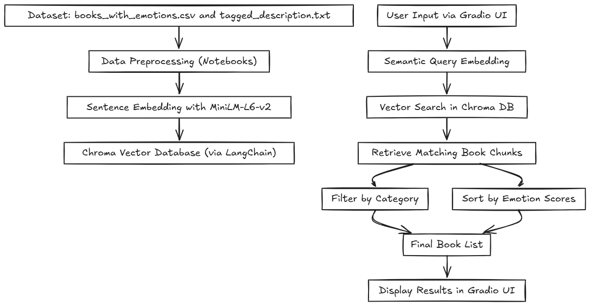

# 📚 Semantic Book Recommender with LLMs

This project is a **semantic book recommendation system** powered by **sentence-transformer embeddings**, **LangChain**, and an interactive **Gradio** UI. It allows users to receive personalized book recommendations based on natural language queries, category filters, and emotional tones extracted from book descriptions.

---
## Architecture Overview

Below is the architecture diagram of the Semantic Book Recommender system, illustrating how data flows from the dataset through preprocessing, embedding, vector search, and finally to the user interface.



---

## 📸 Dashboard Preview

Here is a preview of the Semantic Book Recommender dashboard:


---
## 🚀 Features

- 🔍 **Semantic Search** — Uses MiniLM sentence embeddings to retrieve books similar to user prompts.
- 🏷️ **Category Filtering** — Classifies books into categories like Fiction, Biography, etc.
- 🎭 **Emotional Sorting** — Ranks books based on emotions (joy, sadness, fear, etc.).
- 🌐 **Gradio UI** — Clean user interface for querying and browsing results visually.

---

## 🧠 Main Components

| File                       | Description                                                       |
|----------------------------|-------------------------------------------------------------------|
| `dashboard_gradio.py`      | Main Python app with Gradio interface and book retrieval logic.  |
| `books_with_emotions.csv`  | Final dataset with cleaned metadata, category, and emotion scores.|
| `tagged_description.txt`   | Preprocessed book descriptions with `isbn13` used for vector DB.  |
| `data-exploration.ipynb`   | Initial data cleaning and preprocessing steps.                    |
| `text_classification.ipynb`| Assigns simple categories using LLM-based classification.         |
| `sentiment_analysis.ipynb` | Uses a transformer model to extract emotion scores per book.      |
| `vector-search (1).ipynb`  | Manual test of vector search using LangChain + Chroma.            |

---

## 🧰 Tech Stack

- `Python 3.11+`
- `sentence-transformers` (MiniLM-L6-v2)
- `langchain-community`, `langchain-chroma`
- `Gradio`
- `Pandas`, `NumPy`
- `dotenv` (optional, not used for OpenAI keys in this project)

---

## 📂 Project Structure

```
semantic-book-recommender/
├── .env                    # Empty or ignored in this project
├── chroma_db/              # Vector DB directory created at runtime
├── books_with_emotions.csv
├── tagged_description.txt
├── dashboard_gradio.py
├── *.ipynb                 # Data processing notebooks
```

---

## 💻 Running the App

### 1. Install dependencies

Create a virtual environment and install requirements:

```bash
python -m venv .venv
source .venv/bin/activate  # On Windows: .venv\Scripts\activate
pip install -r requirements.txt
```

Or manually install:

```bash
pip install gradio langchain-community langchain-chroma sentence-transformers pandas numpy python-dotenv
```

### 2. Run the app

```bash
python dashboard_gradio.py
```

You’ll see something like:

```
* Running on local URL: http://127.0.0.1:7860
```

Visit that link in your browser to use the recommender.

---

## 🧠 How It Works

- **Load and Embed Descriptions**  
  Book descriptions are loaded from `tagged_description.txt`, split into chunks, and embedded using `sentence-transformers/all-MiniLM-L6-v2`.

- **Vector DB Creation**  
  Descriptions are embedded and stored using Chroma, a vector database backed by LangChain.

- **Query Matching**  
  User input is also embedded and used to retrieve the most similar book chunks.

- **Filtering & Sorting**  
  Retrieved books are filtered by category and optionally sorted based on emotional tone: joy, sadness, anger, fear, or surprise.

- **Display in UI**  
  Gradio renders the final recommendations with thumbnails, titles, and summaries.

---

## 📌 Dataset

This project uses the Kaggle dataset:

📚 **[7k Books with Metadata](https://www.kaggle.com/datasets/dylanjcastillo/7k-books-with-metadata)**  
It includes book titles, authors, descriptions, thumbnails, and category labels.

---

## 👤 Author

**Taha Bouhafa**  
📧 tahabouhafa1@gmail.com  

